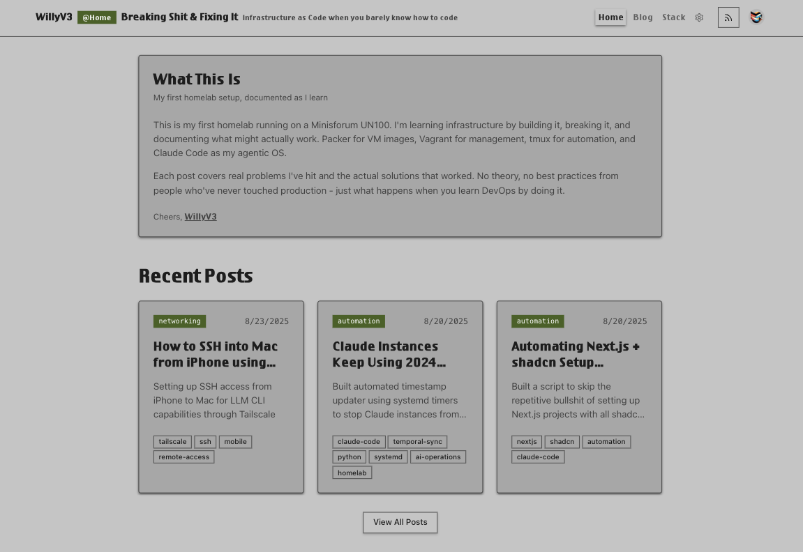
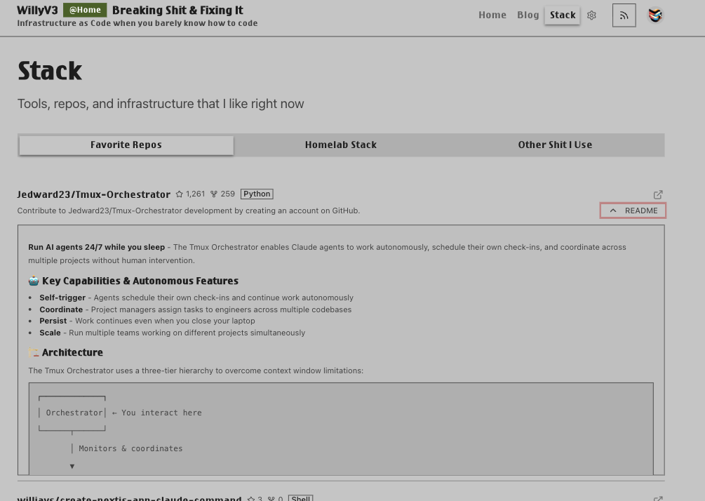

# Homelab Blog Template

This is the source code for my blog site - - - - feel free to jack it and build your own blog - WARNING - I did not clean up any of my hardcoded website metAdata to be generic - you will have to update all metadata on your own! 

A Next.js 15 blog template with authentication, comments, and dual content management.



## Features

- **Dual content system**: MDX files in `/src/content/posts/` or web interface for blog posts
- **User authentication**: Clerk integration with admin controls
- **Comment system**: Threaded comments with likes functionality
- **Stack page**: GitHub repo scraper that displays stats and README without API, other tabs hardcoded, do whatever you want.
- **Auto-generated files**: `llms.txt` and `feed.xml` created during build
- **Page transitions**: Framer Motion with React Suspense for loading states - [used this approach](https://www.youtube.com/watch?v=7WXorRfTinY)
- **Database**: PostgreSQL/Neon with comment threading
- **Styling**: Tailwind v4 with centralized color variables in `globals.css`
- **AI development ready**: Includes `CLAUDE.md` tuned for Next.js 15 and this codebase



## Quick Start

```bash
git clone https://github.com/williavs/homelab-blog-prod
npm install
cp .env.example .env.local
# Set up database (see below)
npm run dev
```

## Database Setup

I used NEON because it was free and they have a nice MCP for Claude Code

Run the schema on your PostgreSQL database:

```bash
# Neon, Supabase, Railway, or local PostgreSQL
psql $DATABASE_URL -f sql/schema.sql
```

The schema includes tables for posts, comments, and comment_likes with proper indexing and foreign keys.

## Environment Setup

Create `.env.local`:

```env
# Clerk auth - get from clerk.com
NEXT_PUBLIC_CLERK_PUBLISHABLE_KEY=pk_test_...
CLERK_SECRET_KEY=sk_test_...

# Database connection string
DATABASE_URL=postgresql://...

# Admin access (your Clerk user ID)
- Get your Clerk hooked up - test in dev - switch to dev - remember to copy your userId thing from Clerk and use it as your admin id in you env vars.

ADMIN_ID=user_your_clerk_id_here

# Multiple admins (comma-separated)
# ADMIN_ID=user_id1,user_id2,user_id3
```

## Content Management

### Method 1: MDX Files

Add `.mdx` files to `/src/content/posts/`:

```markdown
---
title: "Post Title"
date: "2025-08-23"
category: "infrastructure"
tags: ["docker", "homelab"]
excerpt: "Brief description"
---

# Your content

Use React components directly in MDX.
```

### Method 2: Web Interface

Admin users see an admin tab in navigation. Create posts through the web interface with markdown editor. Posts are stored in the database.

Both methods work together - readers see all posts regardless of source.

## Theme Customization

All colors are centralized in `/src/app/globals.css`. Change any color variable and it applies throughout the entire app:

```css
:root {
  --background: oklch(0.8452 0 0);
  --foreground: oklch(0.2393 0 0);
  --primary: oklch(0.5016 0.1887 27.4816);
  /* ... */
}
```

You can copy themes from [tweakcn.com](https://tweakcn.com) or create your own. Keep all styling in globals.css to maintain consistency when AI assists with development.

## AI Development

The codebase includes `CLAUDE.md` with specific patterns for Next.js 15 development. When working with Claude Code:

- All styling variables are predefined - don't create new CSS variables
- Use existing component patterns from the codebase
- The AI understands the hybrid content system (MDX + database)

## GitHub Stack Page

The `/stack` page scrapes GitHub repos without using the API. Add GitHub URLs to display repo stats, descriptions, and README content. Uses web scraping for simplicity.

## Project Structure

```
homelab-blog/
├── src/
│   ├── app/
│   │   ├── (routes)/
│   │   ├── api/
│   │   └── globals.css
│   ├── components/
│   │   ├── ui/           # shadcn components
│   │   ├── blog/         # blog components  
│   │   ├── comments/     # comment system
│   │   └── stack/        # stack page components
│   ├── content/posts/    # MDX blog posts
│   ├── lib/              # utilities, database
│   └── styles/
├── sql/schema.sql        # database schema
├── public/
└── CLAUDE.md            # AI development guide
```

## Admin Access

After signing up through Clerk:
1. Get your user ID from Clerk dashboard
2. Add it to `ADMIN_ID` in `.env.local`
3. Restart the app
4. Admin tab appears in navigation

Multiple admins supported by comma-separating user IDs.

## Deployment

Works on Vercel, Railway, Render, or any Node.js platform. Add environment variables to your deployment platform.

When you deploy the llms.txt and the feed.xml pages get auto-updated so you have an rss feed for your blog and AI agents know wtf you do. Welcome to today ~~~~

## Tech Stack

- Next.js 15 with App Router and React 19
- TypeScript with strict configuration
- Tailwind CSS v4 for styling
- PostgreSQL for data persistence
- Clerk for authentication
- Framer Motion for animations
- MDX for rich content authoring
